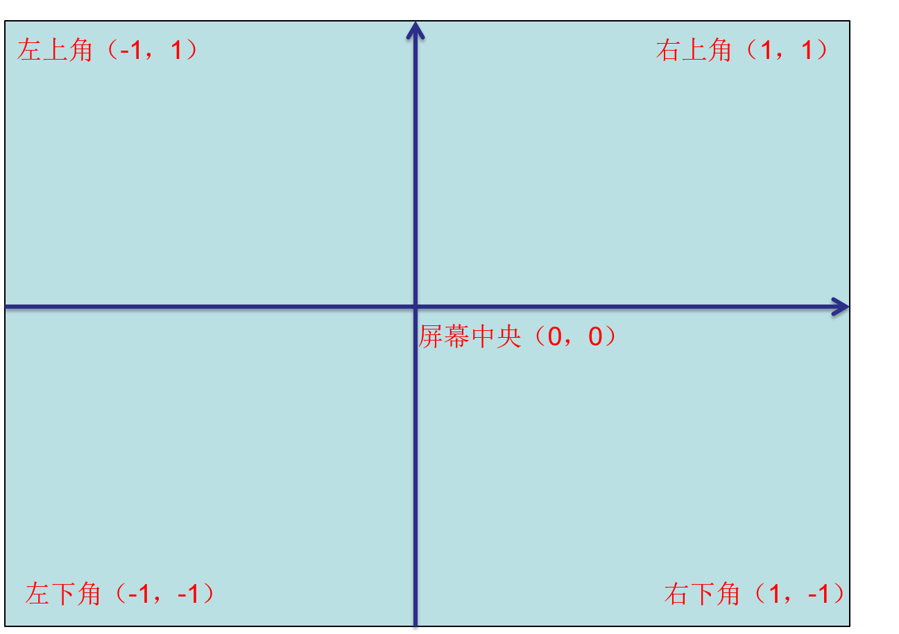
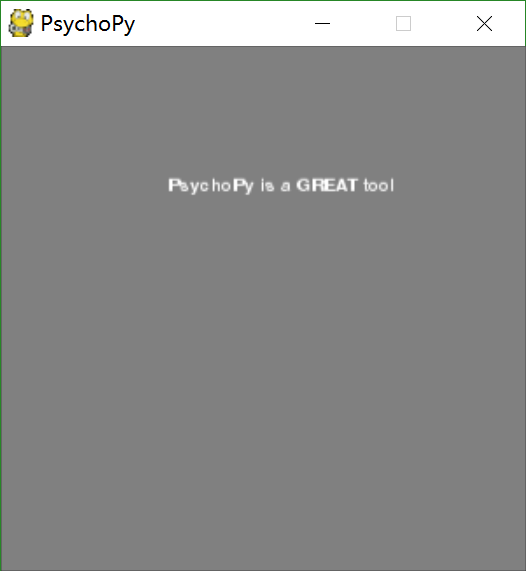
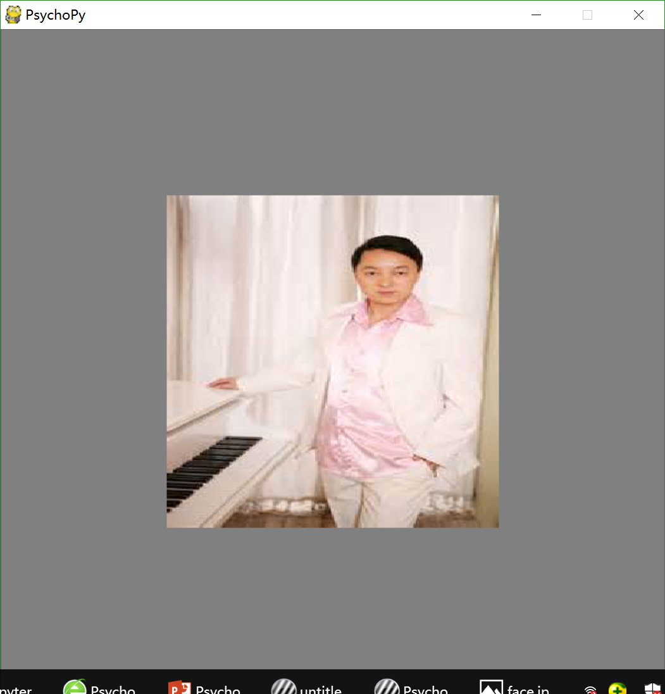

# 第11章. PsychoPy入门 - 基本刺激材料的呈现

作者： 何吉波博士，优视眼动科技公司创始人，hejibo@usee.tech, [http://www.usee.tech](http://www.usee.tech)  


这一节讲述如何通过PsychoPy呈现心理学的常用刺激材料，包括文本、图片、声音、视频等。此外，我们还以经典的视觉搜索任务 (Visual Search Task)为例，讲述如何通过编程实现比较复杂的刺激，例如，在O中搜索Q字母。


## 1. 呈现文本刺激材料

在PsychoPy中，呈现文本信息，使用的是视觉库下的TextStim这个函数。呈现文本信息通常要经过下面的步骤：
1. 先使用from psychopy import visual导入visual这个视觉库，
2. 接着定义一个取名为myWin的画布，
3. 然后使用visual.TextStim函数定义要呈现的文本信息，
4. 随后我们就可以通过psychopyTxt.draw()这个绘制函数讲文本信息绘制到myWin画布上，
5. 最后一步是，使用core.wait(5.0)这个函数来让文本信息停留五秒钟，否则呈现内容就会一闪而过。 

### 1.1. 设置画布
对于每一个刺激PsychoPy程序， 我们基本上都需要设置画布。这是导入相关工具库后做的第一步工作。 我们可以使用visual.Window设置一个画布。其中，第一个参数(800.0,800.0)是设置画布的大小为800*800个像素。monitor='testMonitor'为显示器的名字。 units ='deg'是指定计量单位为度。screen=0是设置当前画布在哪个屏幕中呈现，主要用于具有多屏幕显示的研究。当然monitor='testMonitor', units ='deg', screen=0 这些参数都是可选的，可以删除的。我们列举出来，是出于教学的目的，向读者展现visual.Window可选的参数，也许有的读者感兴趣，或者用得着。 我们直接通过myWin = visual.Window((300.0,300.0))这样简介的方式，也是可以成功设置一个画布的。


【小贴士1】Python和PsychoPy都是大小写敏感的。window和Window是不同的函数或者变量。 我在多个大学授课时发现，同学们经常忘记注意大小写的区分了。另外一个常见错误是拼写错误。比如讲visual.Window写作visual.Widow。而大小写错误和拼写错误在编码和测试时是非常难发现的。 

### 1.2 定义文本刺激
我们可以使用visual.TextStim函数定义文本刺激。 第一个参数myWin就是我们上一段定义的画布的名字。第二个参数color='#FFFFFF'为文本的颜色。 text = u"PsychoPy is a GREAT tool" 是要呈现的文本内容。units='norm'为文本呈现的单位。height=0.1为本文的高度。pos=[0.5,0.5]为文本呈现的位置。 alignHoriz='right',alignVert='top'为文本水平和垂直方向上的对齐方式，使用right和top参数表示水平方向上向右对齐，垂直方向上向上对齐。 

psychopyTxt = visual.TextStim(myWin, color='#FFFFFF',
                        text = u"PsychoPy is a GREAT tool",
                        units='norm', height=0.1,
                        pos=[0.3, 0.5], alignHoriz='right',alignVert='top')

上面的参数基本上都是可选着的。 如果读者觉得用不着，也可以省去不写。如果文本定义好后， 需要修改，也可以通过psychopyTxt.text=u"我爱你，中国！"，或者也可以通过psychopyTxt.alignHoriz='left'这样的方式去修改需要呈现的文本的内容和参数。

#### 1.2.1 文本颜色的控制
PsychoPy提供多种控制文本颜色的方法：1.使用颜色的名字，如‘DarkSalmon’。 2.我们可以使用网页编程中常见的HEX 编码系统， 如color='#FFFFFF'来控制文本的颜色。 3. 我们也可以通过RGB, LMS, DKL的等多种颜色空间来控制文本颜色。 RGB是使用的最多的色彩空间，例如(255,0,0)表示<span style="color:red">红色</span>，(0,255,0)表示<span style="color:green">绿色</span>，(0,0,255)
表示<span style="color:blue">蓝色</span> ,(0,0,0)表示<span style="color:black"> 白色</span>，(255,255,255)表示<span style="color:black">黑色</span>。

下面的代码片断分别演示了使用颜色名字，HEX编码系统，DKL, LMS和RGB等颜色空间来控制文本的颜色。
```python
stim = visual.GratingStim(win, color=[1,-1,-1], colorSpace='rgb') #will be red
stim.setColor('Firebrick')#one of the web/X11 color names
stim.setColor('#FFFAF0')#an off-white
stim.setColor([0,90,1], colorSpace='dkl')#modulate along S-cone axis in isoluminant plane
stim.setColor([1,0,0], colorSpace='lms')#modulate only on the L cone
stim.setColor([1,1,1], colorSpace='rgb')#all guns to max
stim.setColor([1,0,0])#this is ambiguous - you need to specify a color space
```

#### 1.2.2 PsychoPy的坐标系
我们要将文本，图片等刺激放到画布合适的位置， 我们就需要了解PsychoPy的坐标系系统。PsychoPy以pos=[0.3, 0.5]的形式指定视觉刺激呈现的位置。 第一个参数0.3为X轴，控制文本呈现的水平位置； 第二个参数0.5为Y轴，控制文本呈现的垂直位置。屏幕的右侧为X轴的正方向； 屏幕的上方为Y轴的正方向。 图11.1展示的是PsychoPy的坐标系。因此，屏幕的右上角的坐标为(1,1)，右下角为(1,-1), 左上角为(-1,1)，左下角为(-1,-1)，正中央为(0,0)。




<center>图11.XXX PsychoPy的坐标系系统</center>


```python
#!/usr/bin/env python2
# -*- coding: utf-8 -*-
#使用from psychopy import visual导入visual这个视觉库
from psychopy import visual, core, event

#定义一个取名为myWin的画布
myWin = visual.Window((800.0,800.0),
            monitor='testMonitor', units ='deg', screen=0)
myWin.setRecordFrameIntervals()

#使用visual.TextStim函数定义要呈现的文本信息
psychopyTxt = visual.TextStim(myWin, color='#FFFFFF',
                        text = u"PsychoPy is a GREAT tool",
                        units='norm', height=0.1,
                        pos=[0.3, 0.5], alignHoriz='right',alignVert='top')

#通过psychopyTxt.draw()这个绘制函数讲文本信息绘制到myWin画布
psychopyTxt.draw()
    
myWin.flip()

#让文本信息停留五秒钟，否则呈现内容就会一闪而过
core.wait(5.0)
```

<center></center>

<center>图11.XXX 文本刺激材料</center>

### 1.3 呈现颜色丰富的文本
发展心理学和教育心理学的知识告诉我们，正确的教育方式是给学生们他们刚刚可以垫脚努力得到的知识。切记拔苗助长，打击学生们的自信心。因为自信心的维护和培养对未来的成功非常重要。同样的，对于培养大家的编程兴趣和自我效能感，最重要的也是循序渐进地增加代码的复杂度，并将通过分段学习得到的知识整合到一个，也就是从part-task training到full-task training的过程。

我们知道，心理学非常知名的一个实验是Stroop 效应（斯特鲁普效应）（Stroop, 1935; Peterson, et al., 2002）。这个任务要求被试说出字的颜色，而不是念字的读音。当字的颜色和读音一致时，被试的反应时短于字的颜色和读音不一致时。这个实验说明字的颜色时会受到字义的干扰。在您们的心理学课堂中，您们多半参与过这个实验。那么，我们应该怎么呈现Stroop任务呢？由于Python的易学性和易读性，其实，到现在，您已经基本具备技能完成Stroop 任务的刺激呈现了。这个代码示例，也可以很好地整合我们上面讲到的文本刺激材料的呈现和文本的色彩空间的知识。


```python

#!/usr/bin/env python2
# -*- coding: utf-8 -*-
from psychopy import visual, core, event

myWin = visual.Window((800.0,800.0),
            monitor='testMonitor', units ='deg', screen=0)
myWin.setRecordFrameIntervals()

red = visual.TextStim(myWin, color='red',
                        text = u"red",
                        units='norm', height=0.1,
                        pos=[0, -0.1], alignHoriz='right',alignVert='top')
                        
green = visual.TextStim(myWin, color='green',
                        text = u"green",
                        units='norm', height=0.1,
                        pos=[0, 0], alignHoriz='right',alignVert='top')
                        
blue = visual.TextStim(myWin, color='blue',
                        text = u"black",
                        units='norm', height=0.1,
                        pos=[0, 0.1], alignHoriz='right',alignVert='top')                       

red.draw()
green.draw()
blue.draw()
    
myWin.flip()

core.wait(5.0)
```


<center></center>
<center>图11.XXX Stroop任务的样例刺激材料</center>


### 1.4 呈现多行富文本 (Rich Text)
上面的例子已经上我们可以很容易的呈现文字了。可是上面的文字只能单行显示。 我们的试验任务可能需要要求我们呈现多行富文本（Rich Text），例如，实验的指导语等。 当然，我们的确可以通过上面的示例，通过定义多个单行文本变量，并一行调节pos参数来实现多行文本。 可是这样的方案冗长，降低代码的可读性和增加编码的时间和难度。 有没有比较容易的办法来实现多行富文本的呈现呢？

Python的丰富的字符串功能让我们呈现多行富文本信息非常容易。 根据Python基础知识章节的讲解， 我们知道可以使用单引号（'），双引号（""），和三引号（"""）来定义字符串。 三引号（"""）是支持换行的。 要呈现多行富文本，我们只需要使用三引号（"""）赋值给visual.TextStim的text参数即可。 下面的代码块，很好的展示了如何呈现多行的实验指导语。


```python
#!/usr/bin/env python2
from psychopy import visual, core, event

#create a window to draw in
myWin = visual.Window((800.0,800.0))
myWin.setRecordFrameIntervals()


#INITIALISE SOME STIMULI
instruction = visual.TextStim(myWin, color='#FFFFFF',
                        text = u'''         Instruction
                        
This is an experiment instruction. You need to do the following stuff.
1. Fixate at the dot.
2. press the 'Y' or 'N' key 
Press any key to continue''',
                        units='norm', height=0.1,
                        pos=[0, 0.6], alignHoriz='center',alignVert='top'
                       )
instruction.draw()
    
myWin.flip()

#pause, so you get a chance to see it!
core.wait(5.0)

```

## 2. 呈现图片刺激材料

在我们已经掌握如何呈现文本刺激后，呈现图片刺激就没有那么困难了。 因为呈现图片刺激的何以复用呈现文本刺激的绝大多数代码，包括导入关键工具库， 设置画布，绘制刺激和控制刺激呈现时间。 我们只需要新增加定义图片刺激材料的命令就可以了。 

呈现图片信息通常要经过下面的步骤：
1. 先使用from psychopy import visual导入visual这个视觉库，
2. 接着定义一个取名为myWin的画布，
3. 然后使用visual.ImageStim函数定义要呈现的文本信息，
4. 随后我们就可以通过faceRGB.draw()这个绘制函数讲文本信息绘制到myWin画布上，
5. 最后一步是，使用core.wait(5.0)这个函数来让文本信息停留五秒钟，否则呈现内容就会一闪而过。 

以上5个步骤中，只有第3步和文本刺激的呈现略有不同。 

我们通过visual.ImageStim函数来呈现图片。如下的代码块faceRGB = visual.ImageStim(myWin,image='face.jpg',
    pos=(0.0,0.0),
    size=(1.0,1.0))
   
其中，myWin是我们定义的画布的名字。image='face.jpg'设置要呈现的图片的文件名。 pos=(0.0,0.0)设置图片呈现的位置为屏幕中央。 size=(1.0,1.0)表示图片呈现的长宽尺寸，即以长宽都为1度的长度等大小呈现。图11.3展示了下面的图片呈现代码块的显示效果图。

我们在呈现图片刺激时，正确地设置size=(1.0,1.0)的参数是非常关键的。原则上来说， 我们应该以原图片的长宽比(Aspect Ratio)来呈现图片，以避免图片被拉升和变形。例如，我们的示例图片face.jpg是199*300的相素比，当我们以size=(1.0,1.0)的参数呈现时，图片就被横向拉胖了很多。 如图11.4所示，原图中的帅哥是比较苗条的，而当使用不一致的size=(1.0,1.0)参数时，图中的人物就变胖了许多。当然，修改图片的长宽比是一种很快的美颜的办法。 我只需要改变size=(1.0,1.0)的参数，就可以让我的照片一瞬间显得苗条。但是，梦想通常是丰满的，现实是很骨干的。执行一件事情需要很大的意志力。在现实生活中， 我从4月到8月天天不间断地跑步和举重，才从胖子变成了拥有六块腹肌的瘦子。 为了梦想，我们一起加油。


【小贴士2】凡是设计到需要使用其它材料，比如图片、声音、视频文件的代码，最常见的错误就是代码找不到刺激素材在
电脑中的位置。下面的代码块要求代码和图片放置在同一个文件夹下面。如图您在执行本书提供的代码时遇到了类似下面的“	ERROR 	Couldn't find image face.jpg; check path?”的错误，多半的原因就是代码找不到图片刺激放置的位置。

```python
 Running: C:\Users\Dr.He\Documents\Book-Python-for-Psychologist\Ch11 - PsychoPy入门 - 基本刺激材料的呈现\ch11-VisualImageStim.py #####
pyo version 0.8.0 (uses single precision)
2.9368 	WARNING 	Monitor specification not found. Creating a temporary one...
4.1327 	ERROR 	Couldn't find image face.jpg; check path? (tried: C:\Users\Dr.He\Documents\Book-Python-for-Psychologist\Ch11 - PsychoPy入门 - 基本刺激材料的呈现\face.jpg)
Traceback (most recent call last):
  File "C:\Users\Dr.He\Documents\Book-Python-for-Psychologist\Ch11 - PsychoPy入门 - 基本刺激材料的呈现\ch11-VisualImageStim.py", line 10, in <module>
    size=(1.0,1.0))
  File "C:\Program Files (x86)\PsychoPy2\lib\site-packages\psychopy\visual\image.py", line 97, in __init__
    self.setImage(image, log=False)
  File "C:\Program Files (x86)\PsychoPy2\lib\site-packages\psychopy\visual\image.py", line 289, in setImage
    setAttribute(self, 'image', value, log)
  File "C:\Program Files (x86)\PsychoPy2\lib\site-packages\psychopy\tools\attributetools.py", line 137, in setAttribute
    setattr(self, attrib, value)
  File "C:\Program Files (x86)\PsychoPy2\lib\site-packages\psychopy\tools\attributetools.py", line 27, in __set__
    newValue = self.func(obj, value)
  File "C:\Program Files (x86)\PsychoPy2\lib\site-packages\psychopy\visual\image.py", line 276, in image
    forcePOW2=False)
  File "C:\Program Files (x86)\PsychoPy2\lib\site-packages\psychopy\visual\basevisual.py", line 794, in _createTexture
    raise IOError, msg % (tex, os.path.abspath(tex))
IOError: Couldn't find image face.jpg; check path? (tried: C:\Users\Dr.He\Documents\Book-Python-for-Psychologist\Ch11 - PsychoPy入门 - 基本刺激材料的呈现\face.jpg)


```


【小贴士3】呈现依赖于其它素材文件，如图片，声音或者视频时，另外一个常见的错误就是文件名不对，或者扩展名不对。在Windows操作系统下面， 系统可能默认隐藏了文件的扩展名。 比如一个可见的文件名可能是face.jpg，但是它实际的文件名可能是face.jpg.jpg或者face.jpg.png。这也会导致如上所示的“	ERROR 	Couldn't find image face.jpg; check path?”的错误。所以，当您检查代码多次，而且也确保代码和素材文件在同一个目录下时，却非常焦躁的困惑于为什么不能正常执行代码。这时，请检查一下您的电脑是否设置了默认隐藏了文件的扩展名。


```python
#!/usr/bin/env python2
from psychopy import core, visual, event
import psychopy.sound
#create a window to draw in
myWin = visual.Window((600,600))
myWin.setRecordFrameIntervals()
#INITIALISE SOME STIMULI
faceRGB = visual.ImageStim(myWin,image='face.jpg',
    pos=(0.0,0.0),
    size=(1.0,1.0))

faceRGB.draw()
myWin.flip()

#pause, so you get a chance to see it!
core.wait(5.0)


```


<center></center>


<center>图11. XX. 由于长宽比不一致导致变形的PsychoPy中呈现的图片刺激材料</center>

<center></center>

<center>图11. XX. 原始的图片刺激材料</center>


## 3. 呈现常见形状：线条，矩形和圆形

在我们已经掌握了如何呈现文本和图片的情况下，呈现常见的几何形状，如线条，矩形和圆形，也就不太困难了，因为我们基本上只需要更新我们绘制刺激这一小部分的仅仅只有几行的代码。

### 3.1 呈现线条刺激
我们呈现线条的函数为visual.Line。例如，绘制一条水平线条的命令为THoriLine = visual.Line(myWin, start=(0, 0), end=(2.8, 0))。一如往常，myWin为画布的名字。start和end分别设置线条的起点和终点。 start和end的具体值，决定了线条不水平的，还是垂直的。 如果我们仅仅修改X轴的参数(start=(0, 0), end=(2.8, 0))，则线条为水平的。 如果我们仅仅修改Y轴的参数start=(0, 0), end=(0, 1.1)，则线条为垂直的。


```python
#!/usr/bin/env python2
# -*- coding: utf-8 -*-
from psychopy import visual, core, event

#create a window to draw in
myWin = visual.Window((800.0,800.0))
myWin.setRecordFrameIntervals()

#绘制水平线
THoriLine = visual.Line(myWin, start=(0, 0), end=(2.8, 0))
THoriLine.draw()

#绘制垂直线
TVertiLine = visual.Line(myWin, start=(0, 0), end=(0, 1.1))
TVertiLine.draw()
    
myWin.flip()

#pause, so you get a chance to see it!
core.wait(5.0)

```

### 3.1 呈现矩形刺激
我们呈现矩形的函数为visual.Rect。使用square = visual.Rect(myWin,width=1,height=1)命令，我们就可以在名为myWin胡画布，绘制一个宽和高为1的正方形了。此外，我们可以通过square.pos=(0,0)来设置刺激的位置。我们也可以通过square.ori = 45来旋转刺激。 (注：pos为英文position的缩写; ori为orientation的缩写。)


```python
'''
By DR. Jibo He @ uSEE Eye Tracking Inc. 
Written for my student at Chinese Academy of Science.
September 12, 2017
'''
#!/usr/bin/env python2
from psychopy import visual, core, event

#create a window to draw in
myWin = visual.Window((200.0,200.0),allowGUI=False,winType='pyglet',
            monitor='testMonitor', units ='deg', screen=0)
myWin.setRecordFrameIntervals()

#INITIALISE SOME STIMULI
square = visual.Rect(myWin,width=1,height=1)
square.pos= (0,0)
square.ori = 45
square.draw()
    

myWin.flip()
#pause, so you get a chance to see it!
core.wait(5.0)

```

<center></center>

<center>图11. XX. 矩形刺激材料</center>

### 3.3 呈现圆形刺激
我们呈现圆形刺激材料的函数为visual.Circle。一如往常，myWin为画布的名字。radius参数指定圆形的半径，edges参数指定圆形的边界的粗细。 pos参数指定圆形在屏幕中的位置。下面的示例代码会在画布中呈现一个圆形。

```python
#!/usr/bin/env python2
from psychopy import visual, core, event

myWin = visual.Window((800.0,800.0),allowGUI=False,winType='pyglet',
            monitor='testMonitor', units ='deg', screen=0)
myWin.setRecordFrameIntervals()

circle = visual.Circle(myWin, radius=2, edges=32)
circle.pos=(0,0)
circle.draw()

myWin.flip()
core.wait(5.0)

```
### 4. 呈现声音刺激
本章节以前的部分都是演示的视觉刺激（文本和图片），使用的是psychopy的Visual模块。下面我们要演示的是如何呈现声音刺激，需要使用sound模块。因此，我们首先要使用from psychopy import sound导入声音播放模块。然后我们使用tada = sound.Sound('tada.wav')定义一个声音播放素材，指定要播放的声音文件为tada.wav，因此，我们需要把tada.wav和下面的代码放在同一个目录下面。最后，我们使用tada.play()来播放声音文件。

```python
# -*- coding: utf-8 -*-
#!/usr/bin/env python2
'''
by 何吉波@优视眼动科技.
代码用于播放声音刺激。这个代码版可能只适用于Windows操作系统
'''
from psychopy import sound,core
tada = sound.Sound('tada.wav')
tada.play()
core.wait(2)
core.quit()

```

### 5. 呈现视频刺激
呈现视频刺激，我们使用的是visual,MovieStim函数。我们使用mov = visual.MovieStim(win, 'jwpIntro.mov', size=[320,240])这一行代码指定要播放的视频文件为jwpIntro.mov，播放的视频窗口的大小
为320 * 240像素。播放视频的本质是逐帧读取视频，然后播放出来。所以我们使用mov.status != visual.FINISHED判断是否读取到了视频的结尾，如果没有，我们通过mov.draw()呈现新的一帧图像，直到视频的结尾。


播放视频刺激时，有两点需要注意，一是要呈现的视频刺激文件需要和代码在同一个目录，或者在代码中指定视频所在的具体目录；二是，如果视频不能播放，请检查您的电脑里是否正确地安装了该视频所需要的解码驱动。PsychoPy支持AVbin 可以读取的任何视频格式 (例如 mpeg, DivX, mov等)

```python
# -*- coding: utf-8 -*-
#!/usr/bin/env python2
from psychopy import visual, core, event

win = visual.Window([800,600])
mov = visual.MovieStim(win, 'jwpIntro.mov', size=[320,240])
while mov.status != visual.FINISHED:
    mov.draw()
    win.flip()
core.quit()

```

### 6. 呈现较为复杂刺激材料的综合案例
我们做视觉搜索等认知心理学的研究者和学生可能一定听说过，或者熟悉，我们经常需要设计实验，让被试进行搜索任务，比如，从O中寻找C（He & McCarley, 2010; Takeda & Yagi, 2000），或者从O中寻找Q。设计这些刺激是我们研究者的一项基础工作。下面一小节，我们就讲解如何通过上面的基本素材和知识来设计稍微复杂的刺激，比如C，Q, T, L和注视十字(fixation cross)。
#### 6.1. 注视十字(fixation cross), T和L
注视十字可能是认知心理学实验中用得最多的实验材料了。 我们需要使用十字让被试的其实注视点是在固定的位置。 其实， 一个十字是由两条线段组成的。 我们利用 visual.Line()来完成注视十字， T和L。 

```python
'''
注视十字 fixation cross示例
By Jibo He @ uSEE Technology 
hejibo@usee.tech
'''
# -*- coding: utf-8 -*-
#!/usr/bin/env python2


```
我们已经完成了注视十字，要重新做T或者L，仅仅需要的是修改横竖两条线的坐标位置就可以了。 下面的代码显示如何画T和L。
```python
'''
Draw Letter "T" demo
By Jibo He @ uSEE Technology 
hejibo@usee.tech
'''
# -*- coding: utf-8 -*-
#!/usr/bin/env python2


```


```python
'''
Draw Letter "L" demo
By Jibo He @ uSEE Technology 
hejibo@usee.tech
'''
# -*- coding: utf-8 -*-
#!/usr/bin/env python2


```

#### 6.2. 画C字 （半圆月）


```python
'''
Draw Letter "C" demo
By Jibo He @ uSEE Technology 
hejibo@usee.tech
'''
# -*- coding: utf-8 -*-
#!/usr/bin/env python2


```

#### 6.3. 画Q字


```python
'''
Draw Letter "Q" demo
By Jibo He @ uSEE Technology 
hejibo@usee.tech
'''
# -*- coding: utf-8 -*-
#!/usr/bin/env python2


```

<center><bold>参考文献</bold></center>

Derrington, A.M., Krauskopf, J., & Lennie, P. (1984). Chromatic Mechanisms in Lateral Geniculate Nucleus of Macaque. Journal of Physiology, 357, 241-265.

MacLeod, D. I. A. & Boynton, R. M. (1979). Chromaticity diagram showing cone excitation by stimuli of equal luminance. Journal of the Optical Society of America, 69(8), 1183-1186.

He, J., & McCarley, J. S. (2010). Executive working memory load does not compromise perceptual processing during visual search: Evidence from additive factors analysis. Attention, Perception, & Psychophysics, 72(2), 308-316.

Takeda, Y., & Yagi, A. (2000). Inhibitory tagging in visual search can be found if search stimuli remain visible. Attention, Perception, & Psychophysics, 62(5), 927-934.

Peterson, B. S., Kane, M. J., Alexander, G. M., Lacadie, C., Skudlarski, P., Leung, H. C., ... & Gore, J. C. (2002). An event-related functional MRI study comparing interference effects in the Simon and Stroop tasks. Cognitive Brain Research, 13(3), 427-440.

Stroop, J. R. (1935). Studies of interference in serial verbal reactions. Journal of experimental psychology, 18(6), 643.


Color Space. http://www.psychopy.org/general/colours.html

http://www.psychopy.org/api/visual/moviestim.html


