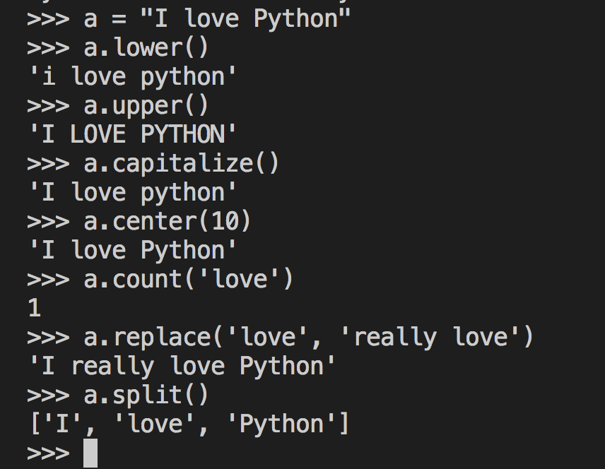

# 第2章 - Python 的变量

作者： 何吉波博士，优视眼动科技公司创始人，hejibo@usee.tech, [http://www.usee.tech](http://www.usee.tech)  

Python语言的变量主要用于存储数据。变量的类型有许多重，包括数字 (Numbers)、字符串 (Strings)、逻辑变量 (Booleans)、集合 (Sets)、列表 (Lists)、元组 (Tuples)、数组 (NumPy arrays)和字典 (Dictionary)等。下面我们将分别介绍这些变量类型。

## 变量名
 Python的变量名可以是以英文字符或者下划线(_)开始的任何变量，如_hello, This, thisVariable等。变量名可以包括英文字符，数字和下划线。大家需要注意的是， Python的变量名是大小写敏感的。This和this是不同的变量。 此外， Python的变量名不能是语言内置的保留字。下面的表格显示的是Python的保留字的列表。
 
## 赋值
与Java或者C语言等不同， Python的变量并不需要提前申明，可以直接赋值。Python的一个变量名也可以重新赋予一个新的类型的变量值，而通常不需要强制地进行数据类型的转换。
比如下面的代码，可以直接将一个字符串“Hello World”和浮点数1.0直接赋给thisString这个变量名。

```python
thisString = "Hello World"
thisString = 1.0

```

Python的变量不需要提前申明，赋予新值时也不需要强制转换，可以让Python的代码更加简洁。但缺乏申明等也会让代码容易出现Bug。我们的Python代码出错时，经常是由于变量名的大小写没有注意， 或者是后面的一个变量名与代码前部分的变量名重复，导致了变量被覆盖了。

如果您想得到一个变量的当前值，您只需要在Python编辑器中输入print thisString 或者在Python解释器中输入thisString然后回车运行就可以了。

您可以通过调用变量本身来更新变量的值，例如
```python
aNumber = 1314
aNumber = aNumber + 520
```


您也可以通过其它变量来为新的变量赋值，例如
```python
a=3
b=4
c= a + b
```
###关于赋值的小技巧
#### 加入深度复制和浅度复制的讨论。


## 数字 (Numbers)
Python的数字变量可以直接进行常见的加(+)、减(-)、乘(*)、除(/)，求模(%)和求幂(**)等表达式。Python的这些表达式非常接近我们常见的数学表达式。由于Python表达式的可读性，我经常使用Python来做计算，而不是用操作系统自带的计算器。

<center></center>
<center>图2.1. 常见python表达式：加、减、乘、除，求模和求幂</center>

细心的朋友们可能已经发现，其它的表达式的结果都正确，可是为什么在Python中3/2的结果是1，而不是1.5呢？这是一个很重要的问题。下面我们将详细解释一下这个问题。

Python的数字变量主要包括整型(Integer)和浮点型（Float）两类。整型数字就是不带小数部分的变量， 比如520，0，-52。浮点数字是带小数部分的变量，如0.0， 3.1415926和520025.1314等。整型和浮点型可以相互转换。int(520025.1314)的输出结果为整型520025。float(0)的输出结果为浮点数0.0。由于Python允许我们不用申明变量的类型，因此，我们绝大多数时候都不需要注意一个数字变量是整型变量还是浮点型变量。但是，当参与计算的有除法时，我们就要特别小心了。 因为，Python的一个表达式的结果的数字类型是由参与计算的数字类型决定的。 如果表达式中全都是整型，那么计算结果也是整型。 如果表达式中有一个是浮点型，那么计算结果也是浮点型。在Python中3/2的结果是1. 而3.0/2和3/2.0, 3.0/2.0的结果都是1.5。如果我们预期计算结果应该是浮点数，那么，我们在参与计算的数字中至少需要有一个浮点数。 我们也可以通过float()函数明确地表示我们要求计算结果也是浮点数。例如，float(3)/2和3/float(2)的结果都是1.5。请读者朋友们理解图2.1.中显示的结果。


<center></center>
<center>图2.2. 除法与浮点数</center>

## 逻辑变量 (Booleans)
布尔逻辑变量 (Booleans)主要用于逻辑判断，它的值通常为True 或者False。读者朋友们请注意的是， Python 的变量是大小写敏感的。 True和False是逻辑变量值，而true和false不是逻辑变量的值。

常用的逻辑判断操作包括==（是否等于）, ！=（不等于）, >（大于）, >=（不小于于）, <（小于）,<=（不大于）， and 或者&（且）, or 或者|（或）， ^ (异或,XOR, exclusive or), is, is not, not等。

进行逻辑判断时， 需要注意的是==与=的区别。 ==是“是否等于”的逻辑判断，而=是赋值操作。 我们写代码时经常的bug就是把==错写成了=。另外就是，不同的语言的不等于可能会有差别，Python的不等于是!= （Matlab的不等于是~=）。is和 is not分别相当于==和!=，但是更接近自然语言，增加了Python的易读性。not 是一种否定的操作。 如果a 是True, not a就是False。请读者朋友们在Python解释器中尝试下面的代码。

>>> a=1

>>> b=2

>>> a==b

False
>>> a is b

False
>>> a is not b

True
>>> not a

False
>>>


and , &, or 和| 用于支持多项逻辑操作。 and和&等价，只有所有的项为True时，整个逻辑操作才为真。 or和|等价，只要有一项为真时， 整个逻辑操作就为真。 我个人更偏好使用and 和or ，因为它的易读性高于&和|。请读者朋友们在Python解释器中尝试下面的代码。
>>> c=True

>>> d=False

>>> c and d

False
>>> c & d

False
>>> c or d

True
>>> c | d

True
>>>

与or (|)相对比的是^（异或）。or 是只要有一个逻辑项为真时，整个逻辑运算就为真。 而^（异或）只有当两个变量不相同时，整个逻辑运算才算真。请大家尝试下面的代码。

>>> e = True

>>> f = False

>>> g = True

>>> e or f

True
>>> e ^ f

True
>>> e ^ g

False
>>>

对于其它语言来说，要说明是一个数的区间时， 我们通常需要两个逻辑判断，比如e>5 & e<8，而对于Python，可以更简洁地写为5<e<8。这样的表达，更接近我们通常的数学书写习惯。

>>> e=6

>>> e>5 & e<8

True
>>> 5<e<8

True


## 字符串 (Strings)
Python的字符串可以用单引号(')， 双引号(")和三引号(''' 或者""" )定义。比如下面的代码，a,b和c都是相同的值的字符串。 Python 支持单引号、双引号和三引号的好处就是，在字符串中依然可以有引号。比如，我们引用谁说了什么话时，本来就需要在字符串中使用引号，如下面代码中的字符串d所示。此外，三引号"""的字符串经常用于函数的说明文档中。在比较字符串时，只与引号内的内容有关系，而与它是单引号、双引号或者三引号无关。下面示例中的a,b和c都是等价的字符串。如果我们的字符串中本来就需要单引号或者双引号时，我们就应该用'''或者"来定义这个字符串了。例如下面示例中的d和e变量。
```python
a = 'I love Python'
b = "I love Python"
c = """I love Python"""
a == b
b == c
d = "Jibo said,'I love Python'."
e = '''She hails:"Smart is sexy. Programmers are cool".'''
```
字符串中可以有转意字符，比如\t代码着制表符，相当于在文本中输入了一个键盘上的tab按钮。\n代码着换行字符。
```python
a = "I love newlines.\nI wish I could marry them.\n\nSigh..."
b = "TABS\tARE\tAWESOME\t!"
```
Python的优雅和简洁之处在于，她的字符串操作非常直观和简洁。其它语言需要很多代码才能完成的字符串操作，Python只需要+和*，以及[]这个切割操作符就可以完成。例如，下面的代码中使用c=a+b就可以将a和b两个字符串连接在一起。而使用*就可以将字符串复制10倍，得到c10，也就是说10遍"I love Python\n"
```python
a = "I love"
b = "Python"
c = a+b
c10 = (a+" "+b+"\n")*10
```
### 字符串的索引与切割 []
在字符串操作中， 我们通常需要得到字符串中的一部分，这个通常叫做字符串的索引（index）或者切割（slicing）操作。在Python语言中， 使用[]完成字符串的索引与切割。[]里面可以有[start: end :step] 开始、步长和结尾三个参数，而且每一个参数都是可选的。当start参数缺失时，默认值为0。 step的默认值为1.end的默认值为-1或者字符串的结尾。而且，start和end参数可以是正数，也可以是负数。正数表示从左向右计数。负责表示从右向做计数。在编程语言中， 我们是从0开始计数的。因此，字符串的第一个字符为0位置。最右侧的字符为-1位置。请读者朋友们在Python的解释器（interpretter）下面练习输入下面的代码， 熟悉如何通常Python进行索引。

>>> sayLove = "I love Python"

>>> sayLove[:]

'I love Python'

>>> sayLove[0]

'I'

>>> sayLove[-1]

'n'

>>> sayLove[3]

'o'
>>>
当我们在[start: end :step]中有两个参数或者三个参数时，就是字符串的切割操作了。下面的示例代码就是觉的slicing操作。 Python让人着迷的地方在于，很多简单的操作，可以胜过其它语言烦杂的代码。例如sayLove[::-1]中，start和end都是默认参数，我们只需要将step赋值为-1，sayLove[::-1]就完成了将字符串从尾到头的转置。

>>> sayLove = "I love Python"

>>> sayLove[2:6]

'love'

>>> sayLove[2:-1]

'love Pytho'

>>> sayLove[2:]

'love Python'

>>> sayLove[::-1]

'nohtyP evol I'


### 字符串的常用函数
Python提供了许多字符串的函数操作，让我们的使用更加便捷。包括lower(),upper(),capitalize(),center(),count(),replace(), split()等。建议读者朋友们逐一实验，了解每一个函数的作用和操作。 
```python
a = "I love Python"
a.lower()
a.upper()
a.capitalize()
a.center(10)
a.count('love')
a.replace('love', 'really love')
a.split()
```

<center></center>
<center>图2.2.Python字符串常用函数操作结果</center>

### 字符串的格式化输出
我们经常需要将字符串格式化输出到一个文本文件中，或者按一定的格式输出到终端。这时，我们可以使用%s,%d, %f, %7.2f这样的格式串来设置输出格式。其中，%s表示一个字符串或者字符，%d 表示以整型输出，%f格式以浮点型式输出，%7.2f表示浮点型的整数部分最多7位，小数部分最多两位数字。具体操作如下例所示：
```python
a = "%s love Python"
print a%"Jibo"
b = "%s loves %s"
print b%("Jibo","Python")
print b%("Jack Ma","Java")
print "My final grade is %f to be exact, which is %2.2f after round up to two decimals, or %d for short."%(99.5672,99.5672,99.5672)
```

<center></center>
<center>图2.3 字符串的格式化输出</center>

### 字符串的高级操作
Python比较省时和省事，因为很多复杂的操作可以叠加在一起用。比如上面的函数和切割操作[]可以结合在一起使用。
例如split()函数可以将一个字符串分割开来，得到一个列表。 我们可以直接在sayLove.split()的结果上用[]直接进行切割操作。例如，sayLove.split()[1]将得到sayLove的第二个单词，而sayLove.split()[1][0]将返回第二个单词的首字母。

>>> sayLove = "I love Python"

>>> sayLove.split()[1]

'love'

>>> sayLove.split()[1][0]

'l'

## 集合 (Sets)
Think about a reaction-time experiment: a researcher collects one response time in every trial. If you want to calculate the median response time, it could be very useful to collect all individual response times in one variable, rather than having one variable for each individual response time. This allows for easier access and calculations.
Now imagine the researcher was also using an eye tracker. This device allows you, amongst other things, to measure pupil size. It will produce lots of data; sometimes over 1000 data points per second! If you want to store all these in a manageable fashion, you simply cannot use a single variable per data point. It would be more efficient to store all data points from one trial in a set. Of course, with a lot of trials, it would be very inefficient to use a single variable per trial. So you will want to store the data sets of every trial into another set. You then end up with a set (of all trials) that contains more sets (each of a single trial), each of which contain a lot of data points (each data point being the pupil size sometime during a trial).
You can easily see this escalate, for example if the researcher decides to add electroencephalography (EEG) recordings. With over 64 electrodes, thousands of data points per trial, and hundreds of trials, you will end up with sets of sets of sets of data! This 'big data' might seem overwhelming now, but you will get a grip on it later on. First you will need to learn about the basic building blocks of Big Data: variables that can hold multiple values.
## 列表 (Lists)
列表(List)，正如其名所言， 是多个变量的集合，其组成元素可以是其它任何类型的变量，例如，数字，字符串，无级，数组，也可以是一个子列表。我们可以使用a=list()或者a=[]两种方式初始化列表。例如，下面的alist是一个字符串列表，blist是一个数字列表，clist是一个空列表，dlist是一个包含三个子列表的列表。
```python
alist = ['I', 'love', 'Python']
blist=[1,2,3,4,5,6,7,8,9,10]
clist=list()
dlist = [alist,blist,clist]
```
### 列表的索引与切割 []
与前面讲的字符串操作相似，我们也可以使用[]对列表进行索引和切割操作。 切记，我们在Python语言中，从0开始计数。 例如，上面代码片断中的blist[0]返回的是1，blist[1]返回的是2. 我们也可以用负数从右向左计数，blist[-1]返回的是10，blist[-2]返回的是9。我们也可以以[start: end :step]的格式进行切割。例如blist[0:4]和blist[:4]得到的是[1,2,3]。blist[7:],blist[7:10]得到的都是[8,9,10]。

多个[]可以并列使用，进行多次索引与切割操作。例如，上例中的dlist[0]得到的是alist对应的['I', 'love', 'Python']。而dlist[0][1]则是dlist的第一个元素alist的第二个元素，也就是'love'。进一步的dlist[0][1][1]则是dlist的第一个元素alist的第二个元素（也就是'love'）的第二个字符"o"。

我们可以以[start: end :step]为格式，设计步长参数。例如，如果我们想得到blist从1到10中的奇数。 我们可以设置步长(step)为2。blist[::2]返回的就是所有的奇数[1,3,5,7,9].blist[1::2]返回的是所有的偶数[2,4,6,8,10]。我们可以将步长设置为负数。比如blist[-1::-1]返回的是逆序排列的[10, 9, 8, 7, 6, 5, 4, 3, 2, 1]。blist[-1::-2]得到的是逆序排列的所有的偶数[10, 8, 6, 4, 2]。blist[-2::-2]得到的是逆序排列的所有的奇数[9, 8, 7, 6, 5, 4, 3, 2, 1]。

请读者朋友们体验下面的代码。最好先估计输出的结果的内容是什么，然后实际操作Python代码验证。
```python

blist=[1,2,3,4,5,6,7,8,9,10]
dlist = [alist,blist,clist]

#simple index and slice
blist[0]
blist[1]
blist[-1]
blist[-2]
blist[0:4]
blist[:4]
blist[7:]
blist[7:10]

# multiple slice and index
dlist[0]
dlist[0][1]
dlist[0][1][1]

# slice with step parameter
blist[::2]
blist[1::2]
blist[-1::-1]
blist[-1::-2]
blist[-2::-2]
```

### 列表的常用函数
如同字符串函数外，Python提供了许多列表的函数操作，让我们的使用更加便捷。包括index(),reverse(),remove(),pop(),append(),extend()等。index()函数返回查找元素所在的首位置。如果列表中有多个该元素，就返回该元素第一次出现的位置。reverse()就是将列表逆序呈现，等同于a[::-1] 。remove()是将该元素出现的第一个位置的元素删除，如果一个列表有多个该元素，就只删除第一次出现的位置，仅仅删除一个该元素。pop()是将所在位置的元素删除。append()是在列表的尾巴处增加一个新的元素。 extend()是增加一个列表中的多个元素。

建议读者朋友们逐一实验，了解每一个函数的作用和操作。 
```python
a = [10, 20, 30, 40]
a.index(10)
a.reverse()
print a
# delete list members
a.remove(20)
print(a)
a.pop(0)
print(a)

# add list members
a = [10, 20, 30]
a.append(40)
print(a)
a = [10, 20, 30]
b = [40, 50, 60]
a.extend(b)
print a
```

<center></center>
<center>图2.4. 列表常见函数操作</center>

### 浅拷贝与深拷贝
Python的列表的元素是可以修改的(mutable)。因此，我们在使用列表时，最常见的问题/bug就是列表元素不小心被修改了。 如同我们在变量那一小节讲解的一样， Python的变量仅仅是指向一个值的指针。例如下面示例代码中的a和b都是指向同一个值[10, 20, 30, 40]的指针。当我们通过 a.append(50)修改a的值时，b的值也跟着变了，虽然表面上，我们并没有对b进行任何操作。 这是我们需要注意的，因为b=a仅仅是一个浅拷贝，b的值会随a的变化而变化。
```python
# a and b pointing towards the same value
a = [10, 20, 30, 40]
b=a
print a
print b

# b changes as a change, although b is not explicitly touched.
a.append(50)
print a
print b
```

<center></center>
<center>图2.5. 列表浅拷贝示例</center>

为了避面上面很难察觉的错误，我们在为一个变量生成新的拷贝时，需要使用深拷贝操作。具体地，我们不应该使用b=a这样的模式进行浅拷贝，而应该使用   from copy import copy下的copy()函数，通过b = copy(a)进行深拷贝。请读者朋友们对比图2.5和图2.6浅拷贝和深拷贝的区别。
```python
from copy import copy
a = [10, 20, 30, 40]
b = copy(a)

# b is not changed when a changes, as b is a deep copy of a.
a.append(50)
print a
print b
```

<center></center>
<center>图2.6. 列表深拷贝示例</center>

## 元组 (Tuples)
从上面的示例可以看出， 如果我们不小心修改了列表，将会无意地产生bug。因此，有时，我们很期望有一个类似列表的数据结构，但是它的值是不能修改的。例如，一周的七天，这算固定值 ，我们通常不会修改它。 实验的固定参数，我们也不期望被修改。因此，为了避免错误的不需要的修改，我们通常把这些固定值放到元组里面。

元组是一个和列表类似的值的集合。它看着像列表，闻着像列表，摸着像列表。主要的表面区别是列表是用[]或者list()定义的，而元组是用()或者tuple()定义的。列表使用中括号，元组使用小括号。元组和列表最主要的不同是，元组是不可修改的(immutable)，而列表是可以修改的(mutable)。如下面的代码所示，我们可以通过 alist.append("very much")修改一个列表，但是当我们尝试通过atuple.append("very much")修改元组时，就会出现错误。报错为AttributeError: 'tuple' object has no attribute 'append'。

元组很好学习，因为它除了不能改变外，其它的定义和索引基本上都与列表相同。我们可以通过index()和count()函数对元组索引以及计数。

```python
alist = ["I","Love","Python", "Still"]
atuple= ("I","Love","Python", "Still")

# we can do index and slice for both tuple and list
alist.count("Love")
atuple.count("Love")
alist.index("Love")
atuple.index("Love")
alist[0]
atuple[0]

# list is mutable, while tuple is immutable.
# thus, we can change a list, but cannot change a tuple.
alist.append("very much")
atuple.append("very much")
```


<center></center>
<center>图2.7. 列表可以修改(mutable)，元组不可修改(immutable)对比示例</center>

## 字典 (Dictionary)
第三种集合类型是字典（Dictionary）。正如其名所示，字典就是一个key:value配对的集合，其中key为用于索引的变量，value是key对应的值。key和value都可以是任何的变量类型，包括数字，字符串，元组，列表，甚至是字典。定义字典的方式与列表和元组类似，只不过使用的是{}或者dict()。也就是说，凡是用{}包括的带:的成对出现的元素构成的就是字典。因为字典可以将索引和值建立关系，构成一个集合。因此，字典是我们用来统计分数，或者记录被试的实验表现的良好数据结构。我们也可以把字典当成一个非常顺手的数据库。

字典的赋值或者初始化是通过adict={"Jibo":100,"Robot":99,"Monkey King":59}这样的大括号完成的。 要为字典增加一个新元素，我们使用adict["Huang Rong"] =101这样的格式就可以了。(作者案：“因为黄蓉聪明伶俐，人见人爱。考试分数当然比Jibo分数高一些啦。 ^-^”)

虽然字典长得和列表或者元组有点儿像，但是字典的索引操作却不能如往长一样用[]进行索引。我们只有通过字典的查询值key去得到字典对应的值value。使用方式如adict["Jibo"]。当key在字典中不存在时，就会报错KeyError: 'Jabo'，如图2.8所示。我们可以通过adict.keys()和adict.values()分别得到字典的所有的索引值key和值value。

```python
adict={"Jibo":100,"Robot":99,"Monkey King":59}
print adict.keys()
print adict.values()
adict["Huang Rong"] =101
print adict

adict["Jibo"]
adict["Jabo"]
```

<center></center>
<center>图2.8. 字典的定义与索引示例</center>

因为字典的“索引：值”（key:value）成为出现，把多个变量/数据绑定在一起。字典就天然地是良好地记录被试的因变量的好东东啦。例如，我们可以通过下面的形式记录被试1和被试2的反应时(Reaction time, RT)与正确性(acc)。
```python
data = {}
data['subject-1'] = {'RT':[300, 256, 35], 'acc':[1, 1, 0]}
data['subject-2'] = {'RT':[400, 512, 100009], 'acc':[1, 0, 1]}
print data
```

## 数组 (NumPy arrays)
最后一种我们科学家常用的数据类型是数组 (NumPy arrays)。（小时候，阿爸阿妈和老师们都期望我们能够当上科学家。 在英语环境下，psychologist或者scientist的要求并没有中文那么高。如果您们在读心理学或者社会科学的博士，您们也可以被称为psychologist或者scientist了啦。恭喜您们，梦想成真）。那么，NumPy就是我们科学家最常用的一个数据类型啦。因为我们经常要与数据打交道，期望从数据中得到显著(p<.05,p<.01,甚至p<.001。God Bless)。

与列表，元组和字典不同，NumPy不是Python默认自带的数据类型，我们需要安装NumPy的库，才能使用NumPy下的函数。请参见第一章节，复习一下如何安装NumPy的库。

在使用numpy数组时，我们首先要使用import numpy。正如我们小时候看过的《布雷斯塔警长》（BraveStarr）动画片一样，我们首先要吼一句“给我熊的力量”或者”给我豹的速度“后，我们才能如熊一样力大无穷，如豹子一样奔驰如电。我们要先吼一句"import numpy"，才能得到numpy一切美好的力量。

接着，我们就可以使用numpy.array([1, 2, 3, 4]) 这样的格式，从列表中定义一个numpy的数组。numpy数组的索引与切割方式与列表非常相似，我们可以通过bArray[0] ，bArray[-1]和bArray[1:3]这样的形式快速获得numpy数组的元素。

```python
import numpy
bArray = numpy.array([1, 2, 3, 4]) 
print (bArray)

# index and slice a numpy array
bArray[0] 
bArray[-1]
bArray[1:3]

# +,-,*,/ common mathematical operation for numpy array.
bArray+2
bArray- 2
bArray* 3
bArray / 2.0

# manipulate a specific element of numpy array
bArray[0] += 1
bArray[1:3] += 10
print bArray
```

<center></center>
<center>图2.9. numpy数组的定义与常见数学操作</center>

大家可以看到，numpy的很多操作列表也可以完成。我们之所以要费力安装numpy,是因为numpy提供了许多常用的科学用函数，让我们的统计分析变得非常简单。 比如我们在心理学统计或者社会学统计课程中用到的许多变量，都可以直接在numpy简单地调用函数完成。如图2.10所示。下面的代码示例的是我们做完了一个简单的反应时实验后，期望计算反应时（RT）的平均值(mean)，中数(median)，标准差(std)和方差(var)的函数。
```python
import numpy
RT = numpy.array([1001, 1510, 1203, 905,897]) 
numpy.mean(RT)
numpy.median(RT)
numpy.std(RT)
numpy.var(RT)
```
